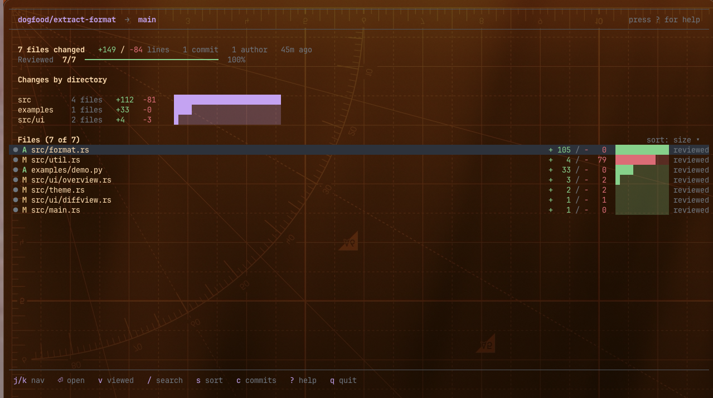
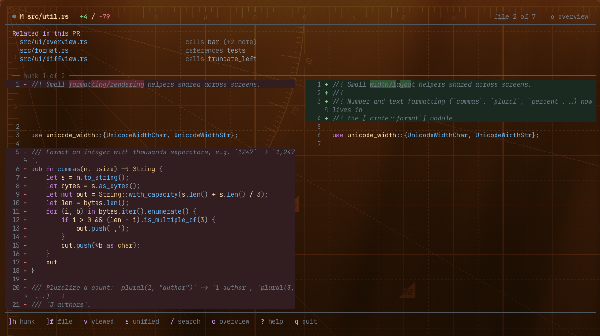

# rudiff

A fast, read-only terminal viewer for git diffs — built for reviewing a feature
branch the way you'd review a pull request, as an alternative to GitHub's web UI.

It never modifies git state. It is a viewer, not a git client.

<p align="center">
  
</p>

```
rudiff                  # default branch vs HEAD (PR semantics)
rudiff main             # merge-base(main, HEAD) vs HEAD
rudiff main..feature    # direct diff main → feature
rudiff main...feature   # merge-base diff (PR semantics)
rudiff abc123           # merge-base(abc123, HEAD) vs HEAD
rudiff abc123..def456   # arbitrary range
```

Bare refs and `A...B` use three-dot (merge-base) semantics, matching how a pull
request is rendered; `A..B` is a literal two-dot diff.

## Features

- **Overview screen** — stats, a prominent *reviewed* progress bar, a rollup of
  changes by group (or directory), and a navigable file list.
- **Diff view** — unified or side-by-side, with syntax highlighting, enclosing
  function context in hunk headers, intra-line (changed-character) highlighting,
  and folded context you can expand.
- **Viewed status that survives rebases** — files are marked viewed by a hash of
  their *diff content*, not their path or commit SHA. A rebase that doesn't
  change a file keeps it viewed; a rebase that meaningfully changes it
  re-surfaces it automatically. Persisted to `<git_dir>/rudiff/viewed.json`.
- **Related-in-PR panel** — tree-sitter name matching flags other changed files
  (across languages) that reference the symbols defined in the open file.
- **Custom groups** — group changes into vertical domain slices via
  `.rudiff.toml`.
- **Explain with Claude** — press `e` to ask the Claude Code CLI (`claude -p`)
  to summarize the current file's diff (or the whole branch from the overview).
  A popup lets you add optional guidance first (e.g. "focus on security" or "is
  this thread-safe?"). The response **streams in live** (with light Markdown
  formatting — headings, lists, bold, inline code) as it's generated; `esc`
  cancels it mid-flight, and the finished text stays in a scrollable overlay.
  Pick the model (haiku / sonnet / opus) in `.rudiff.toml`. Requires `claude`
  on your PATH.

<p align="center">
  
</p>
<p align="center"><sub>Side-by-side diff view, with the related-in-PR panel and syntax highlighting.</sub></p>

## Keybindings

Press `?` in the app for the full list. Highlights:

| Context  | Keys |
|----------|------|
| Global   | `q` quit · `?` help · `e` explain with Claude · `esc` back/cancel |
| Overview | `j`/`k` move · `⏎` open · `v` viewed · `space` multi-select · `/` filter · `s` sort · `c` commits |
| Diff     | `]h`/`[h` hunk · `]f`/`[f` file · `]r`/`[r` related · `o` overview · `v` viewed+next · `s` unified/side-by-side · `w` whitespace · `z`/`Z`/`zR`/`zM` folds · `/` `n` `N` search |

## Configuration: `.rudiff.toml`

Discovered by walking up from the current directory. Groups are flat (vertical
domain slices, not layers) and use gitignore-style globs:

```toml
[[group]]
name = "Auth"
patterns = ["server/src/auth/**", "clients/*/src/auth/**"]

[[group]]
name = "Billing"
patterns = ["server/billing/**"]
```

Files matching no group fall under "Other"; a file matching several groups
appears under each (counted once in totals). Pass `--no-config` to ignore the
file, or `--config <path>` to point at a specific one.

An optional `[explain]` table picks the model used by the `e` command:

```toml
[explain]
model = "sonnet"   # one of: haiku, sonnet, opus
```

When unset, `claude`'s own default model is used. An unrecognized value is
warned about and ignored.

## Building

```
cargo build --release
./target/release/rudiff
```

Requires a recent stable Rust toolchain. Highlighting covers Rust, TypeScript,
JavaScript, Java, Python, and Go; other files render without highlighting.

## Notes

- Layout auto-switches to side-by-side at terminal widths ≥ 165 columns (force
  with `--unified` / `--side-by-side`).
- The Kitty keyboard protocol is enabled where the terminal supports it, and
  degrades gracefully otherwise. Truecolor is used when `COLORTERM` advertises
  it, falling back to 256-color.
- Commit-by-commit review is intentionally deferred to v2; `c` shows a read-only
  list of the commits in the range as a placeholder.
